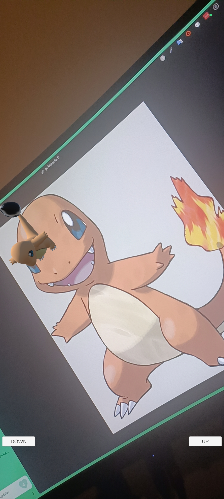

This project is a Pokémon AR app that allows users to see and interact with Pokémon in the real world. The app supports the following Pokémon:

- Articuno        
- Feraligatr      
- Totodile
- Charmeleon      
- Quilava         
- Bellossom       
- Ho-Oh           
- Typhlosion
- Croconaw        
- Raikou          
- Blastoise       
- Ivysaur         
- Venusaur
- Cyndaquil       
- Smeargle        
- Caterpie        
- Metapod         
- Wartortle
- Donphan         
- Squirtle        
- Charizard       
- Moltres         
- Zapdos
- Entei           
- Swampert        
- Charmander      
- Phanpy          

> Go to this location to see the full list of Pokémon pictures targeted by the application : [Pokémon pictures](https://github.com/Tykok/IMTD-011-Pokemon-RA-Unity/tree/main/.github-project/)

There are **2 buttons** (*UP* and *DOWN*) on the screen to enlarge or reduce the Pokémon as desired.

> To install the application, download the [APK here](./APK).
Here's an example what the application looks like when built on Android :

